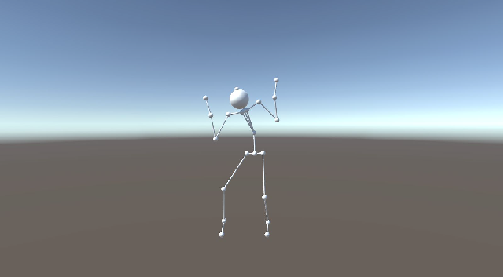

# Ex 1 - Animation & Transfirmations

&nbsp;The goal of this exercise was to learn about animation, homogeneous coordinates and 3D transformations. 
&nbsp;In this exercise I used BVH files to draw and animate a 3D character on screen.

