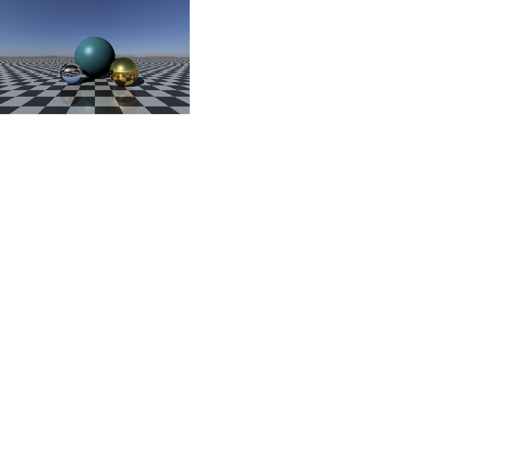

# Computer-Graphics

#### These mini projects were created as part of the Computer Graphics 2020 course @ Hebrew University of Jerusalem

Project 0 - Intro to Unity

Project 1 - Skeleton animation

Project 2 - Meshes & Shaders

Project 3 - Texturing

Project 4 - subdivision

Project 5 - Ray Tracing

For additional information see the README file of each project.  

