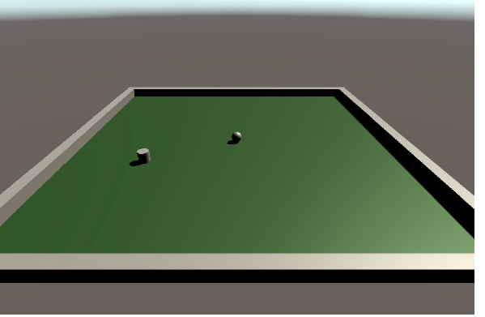

# Ex 0 - Welcome to Unity

In this exercise we created a small game in which the player controls a sphere that collects cylinder-shaped "food" to gaim points (so much fun!). The goal of this exercise was to learn about projects, scene navigation, scripting, and Unity in general.
(Note: this exercise was not for submission)

