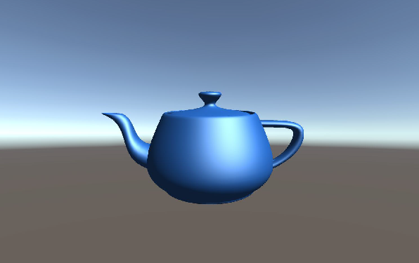

# Ex 2 - Meshes & Shading

The goal of this exercise was to learn about the rendering pipeline, meshes, shaders and lighting in 3D.
In this exercise I used OBJ files to draw and shade meshes. First, I processed a raw mesh data and calculated surface normals for the mesh.
Then I implemented the Blinn-Phong lighting model in the shader file.

