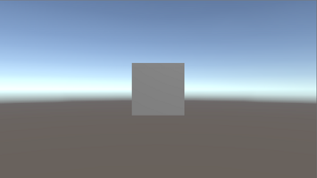
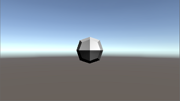
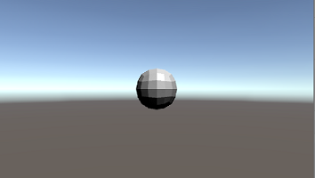
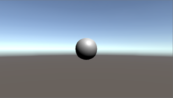

# Ex 3 - Subdivision Surfaces

In this exercise I implemented the Catmull-Clark subdivision algorithm.
The goal of this exercise was to learn about subdivision surfaces and working with mesh data structures.

1) A given cube object before running the Catmull-Clark algorithm on it.

2) The cube object after a single run of the Catmull-Clark algorithm on it.

3) The cube object after another run of the Catmull-Clark algorithm on it.

4)  The cube object after a few more runs.

