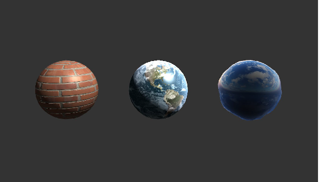
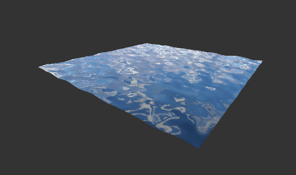

# Ex 4 - Textures

In this exercise I created different materials using texturing techniques such as Perlin noise and Value noise.
The goal of this exercise was to learn about shaders, texturing, UV mapping, displacement mapping and more.

# Some examples:
The bricks shader was implemented using albedo mapping, specular mapping and bump mapping.
The earth shader was implemented using spherical texture mapping.

This shader makes a simple plane look and behave like water. It was implemented using procedurally generated Perlin noise, displacement mapping and reflection mapping.

